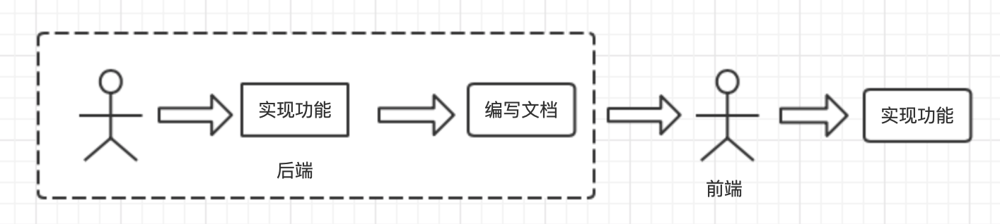
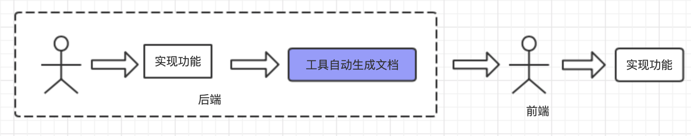
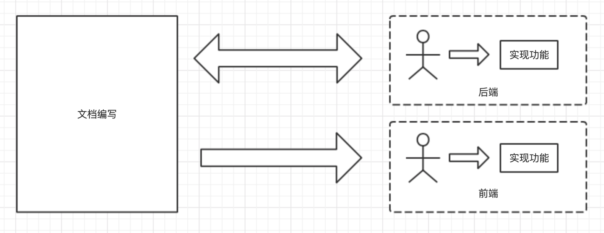

## OpenAPI 相关调研


### 什么是API

> API（Application Programming Interface，应用程序接口）是一些预先定义的函数，或指软件系统不同组成部分衔接的约定。
> 目的是提供应用程序与开发人员基于某软件或硬件得以访问一组例程的能力，而又无需访问原码，或理解内部工作机制的细节。
> —— 百度百科

> An application programming interface (API) is an interface or communication protocol between different parts of a computer program intended to simplify the implementation and maintenance of software.
> —— wikipedia
> 

从以上定义上可以粗略概括理解为：API是一种***契约*** </br>
针对我们项目的的场景，这种契约大致主要规范/定义了以下操作

+ 内部系统对资源访问的时的输入、输出，以及相关的描述说明
+ 外部系统对系统访问时的输入、输出，以及相关的描述说明

契约双方分别为服务调用者、服务提供者。更具体一点就对应到我们的前端研发同学和服务器后端研发同学双方通过约定好的契约进行合作（前端交互展示，后端提供数据支持）

### Why API First

基于以上的描述，针对每一个需求我们的合作方式大概有以下几种方式

+ 后端同学实现功能编码 -> API文档编写 -> 前端同学查看API文档调用接口实现数据填充



+ 后端同学实现编码功能 -> 使用工具根据代码自动API生成文档 -> 前端同学查看API文档调用接口实现数据填充

 

+ 后端同学设计接口文档 -> 后端实现功能、前端实现功能              

  

孰优孰劣从图片可以比较直观地看出，前面两种方式前端同学在功能的实现上依赖于后端同学工作进度，而第三种方式则让前后端通过中间的契约（API文档）进行了解耦，当文档定义好之后，双方可以独立进行各自的工作。

另外，我之前调研过一段时间使用业务代码生成文档的方式，即服务端同学写完代码之后可以快速从代码的一些配置生成相应的接口文档（对应上面第二种协作方式），但是这样有很多问题

+ 违反契约精神，因为文档是根据代码生成的，所以后端可以非常方便的更改文档的内容，即改变了之前前后端契约的约定，容易造成前后端人员所掌握的信息不一致
+ 文档和代码过度耦合，理论上讲代码只是文档契约要求的一种实现方式，如此紧密地耦合在一起的话，如果文档需要进行某些描述的变更，则必须先更改已发布的代码，然而仅仅是某些非功能性描述的变更就会导致代码的无谓的更改

[Understanding the API-First Approach to Building Products](https://swagger.io/resources/articles/adopting-an-api-first-approach/)

### 文档工具

无论使用哪种工作流程，文档的编写都看起来不是那么的easy，目前我们的文档使用World编写，版本控制、多人协作等方面都难以保证，所以目前我们的大概的需求点如下

+ 简单、快速
+ 一致性
+ 可维护
+ 可读（针对一些工具来说）
+ 扩展性

综上，目前比较主流并且适合我们当前情况的API文档工具为Swagger，下面我们主要介绍Swagger相关内容。

### 什么是OpenAPI

> OpenAPI 规范（OAS）定义了一个标准的、语言无关的 RESTful API 接口规范，它可以同时允许开发人员和操作系统查看并理解某个服务的功能，而无需访问源代码，文档或网络流量检查（既方便人类学习和阅读，也方便机器阅读）。正确定义 OAS 后，开发者可以使用最少的实现逻辑来理解远程服务并与之交互。
此外，文档生成工具可以使用 OpenAPI 规范来生成 API 文档，代码生成工具可以生成各种编程语言下的服务端和客户端代码，测试代码和其他用例。


以上是比较官方的解释，我们可以把OpenAPI简单理解为一种API描述的规范或者是文档描述语言。

### 什么是Swagger

Swagger是一套围绕OpenAPI规范构建的开源工具，可以帮助您设计，构建，编写和使用REST API。</br>
主要的Swagger开源工具包括：

+ [Swagger Editor](https://swagger.io/tools/swagger-editor/) - 基于浏览器的编辑器，您可以在其中编写OpenAPI规范。
+ [Swagger UI](https://swagger.io/tools/swagger-ui/) - 将OpenAPI规范呈现为交互式API文档。
+ [Swagger Codegen](https://swagger.io/tools/swagger-codegen/) - 根据OpenAPI规范生成服务器存根和客户端库。

还有一些pro版本的Swagger工具可以去[Swagger官网](https://swagger.io/)了解

### OpenAPI vs Swagger

>OpenAPI = 规范 </br>
Swagger = 实现规范的工具

### OpenAPI 语法

***版本说明：*** </br>
`OpenAPI`规范主要分为两个版本

+ swagger: 2.0
+ openapi: 3.0 

~~3.0版本支持很多新的特性，但是语法和2.0版本有些许不同，因为我们没有历史包袱，所以综合考虑建议直接使用3.0版本(swagger2.0可以在线转换成OpenAPI3.0)~~

***YAML vs JSON：*** </br>

~~由于YAML文件内容可读性相对更好，所以建议使用YAML文件格式进行输出~~


OpenAPI 3.0版本 语法结构

``` yaml
# OpenAPI 规范版本号
openapi: 3.0.0

# API 元数据信息
info:

# 服务器连接信息
servers:

# API 的分组标签
tags: 

# 对所提供的 API 有效的路径和操作
paths:

# 一个包含多种纲要的元素，可重复使用组件
components:

# 声明 API 使用的安全机制
security:

# 附加文档
externalDocs:
```

[OpenAPI中文文档](https://fishead.gitbooks.io/openapi-specification-zhcn-translation/content/versions/3.0.0.zhCN.html#revisionHistory)</br>
[OpenAPI2.0官方文档](https://swagger.io/docs/specification/2-0/basic-structure/)</br>
[OpenAPI3.0官方文档](https://swagger.io/docs/specification/about/)</br>
[OpenAPI规范摘要](https://www.jianshu.com/p/5365ef83252a)</br>
[Swagger Editor在线编辑器](https://editor.swagger.io/)</br>
[OpenAPI Map](http://openapi-map.apihandyman.io/) 文档层次结构</br>
[OpenAPI Tools](https://openapi.tools/) 一些工具</br>
[yaml 语法规则](https://www.runoob.com/w3cnote/yaml-intro.html)<br/>
 
### 还需要做的

 + [x] swagger editor 本地服务搭建
 + [x] 【调研】解析yaml/json并根据其内容对接口进行验证
